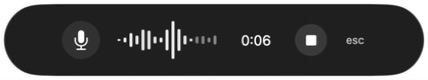
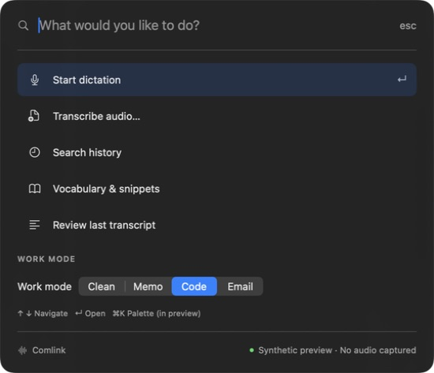
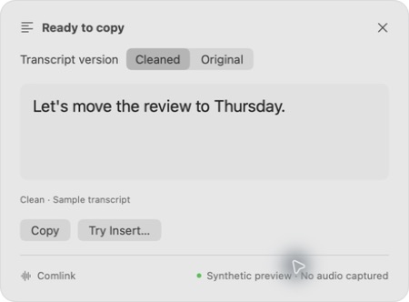

# LF-163 · Native hybrid prototype validation

Validated 2026-09-23 (America/Chicago) on Apple Silicon macOS with Swift 6.3.3. **Ready for design review, not production acceptance.** No phase was advanced. Resume with Luke's review of the combined prototype and the proposed interaction decisions.

## Scope and files

- `prototypes/macos/`: dependency-free native SwiftUI/AppKit preview, separate synthetic state model, six executable test groups, and launch documentation.
- `scripts/dev/preview-macos.sh`: builds a local `.app` and opens it; `--build-only` is available.
- `scripts/e2e/lf-163-macos-prototype.sh`: state tests, native build, app-bundle checks, and isolated config check.
- `docs/design/lf-163-plan.md` and `docs/design/lf-163-macos-hybrid.md`: scoped plan, proposed interactions, Rust integration slice, and mapping to existing human gates.
- `docs/validation/artifacts/lf-163/`: application-only screenshots containing synthetic text.

The Rust CLI, dependencies, schema, exit codes, privacy behavior, and pre-existing untracked concept boards are unchanged.

## Exact commands and observed results

| Command | Observed result |
| --- | --- |
| `cargo fmt --check` | PASS, exit 0 |
| `cargo clippy --all-targets -- -D warnings` | PASS, exit 0 |
| `cargo test --all` | PASS, exit 0: 89 unit + 2 audio integration + 7 meeting lifecycle tests |
| `cargo run -- doctor` | PASS, exit 0: local FFmpeg, whisper-cli, model, clipboard, data path and system-audio checks OK; microphone remains a manual permission check |
| `scripts/e2e/lf-163-macos-prototype.sh` | PASS, exit 0 after the final code change: six Swift check groups, native app build, valid plist, executable present, isolated config directory untouched |
| `scripts/dev/preview-macos.sh` | PASS, exit 0; actual native app launched and inspected through accessibility and screenshots |
| `bash -n scripts/dev/preview-macos.sh scripts/e2e/lf-163-macos-prototype.sh` | PASS, exit 0 |
| `git diff --check` | PASS, exit 0 |

An initial `swift test --package-path prototypes/macos` attempt failed because this Command Line Tools installation has no XCTest module. The final supported command uses a standalone debug executable (`swift run --package-path prototypes/macos PrototypeChecks`) and requires no XCTest download or full Xcode installation.

The shell E2E is a build/state/bundle smoke suite, not an automated GUI driver. The native UI walkthrough below was executed separately with computer-use tools. No real capture, ASR, network traffic, retained history, or insertion is implemented by the preview. Source inspection confirms no networking/capture/history adapters are invoked; no packet-level network audit was performed.

## Automated test coverage

1. Idle → listening → processing → completed, preservation of original/cleaned fixture and selected CLI mode.
2. Cancel during processing, ignore a stale completion, restart safely with a new session token.
3. Permission and missing-model failures before capture; invalid finish cannot bypass failure.
4. No-speech yields no transcript; insertion failure preserves the result for Copy fallback.
5. Reset invalidates pending work; invalid stop/cancel/insert/finish transitions do nothing.
6. Case-insensitive palette filtering, no matches, arrow-key wrap in both directions, and safe empty-list navigation.

## Agent-run native walkthrough

Observed in the launched `.app`:

- Initial controller, selected Code mode, Start; only the capsule remained, with a ticking timer and accessible Stop/Cancel.
- Stop showed a distinct processing state, then a full compact result. No palette opened during the primary flow.
- Original showed the synthetic filler `Um,`; Cleaned omitted it. Code remained the sample's selected mode.
- Try Insert showed failure and retained the text. Copy succeeded; opening the palette and pasting into its search field produced exactly `Let's move the review to Thursday.`
- Palette opened using app-local `⌘K`; search focused immediately. Up wrapped from the first action to the last; Return opened review. Typed `history` filtered to the correct action.
- Escape returned from a detail screen with no focused text field; a second Escape closed the palette.
- Permission failure showed the System Settings path; simulated access recovery started listening. Cancel discarded the sample.
- Missing model displayed local-model guidance and a recovery control. No-speech after Stop showed retry without a transcript; retry completed successfully.
- Light and dark palette/result surfaces were inspected. A fresh Light sample displayed its text on the first completed frame after the explicit foreground-style fix.
- Native menu exposed Start/Stop, Cancel, Command palette, Preview controls, and Quit; Preview controls reopened from it.

## Problems found and regression checks

| Finding | Fix | Repeatable regression check |
| --- | --- | --- |
| `esc` wrapped vertically in the listening pill | Fixed capsule width and nonwrapping cancel label | Checklist step 2; `listening.png` |
| Result initially used the smaller pre-result panel size | Create a fresh result host before measuring and positioning | Steps 2 and 5; completed and error screenshots |
| Escape did nothing on palette details after search lost focus | Route native panel cancel/key events into palette back navigation | Step 4 explicitly removes field focus; agent reran it successfully |
| Preflight errors left the preview controller in front | Hide controller for every non-idle state before presenting the surface | Step 5 permission/model scenarios; screenshots |
| First Light result could show an undrawn selectable transcript until toggling Original | Set the transcript's foreground style explicitly | Step 6: fresh Light completion before any click; final `completed-light.png` |

Layout and native event-routing regressions are covered by these repeatable manual checks and screenshot evidence, not automated pixel assertions. Cross-app focus and accessibility behavior still need human validation as described below.

## Manual design-review gate

From the repository root:

```bash
scripts/dev/preview-macos.sh
```

1. Inspect the controller and the menu-bar waveform. Confirm the pill/menu-bar + on-demand palette direction feels coherent. This controller is only preview scaffolding.
2. Choose **Successful dictation**, select a work mode, and **Start preview**. Confirm a compact charcoal capsule with readable timer, square Stop, and one-line `esc`. Stop. Confirm processing, then an unclipped result, without opening the palette.
3. Switch **Original / Cleaned**. Confirm `Um,` appears only in Original. Click **Copy** and paste into a disposable text field. Click **Try Insert…**: it must show failure, preserve output, and offer Copy; no text should enter or submit in another app.
4. Open **Command palette…** from the menu or use `⌘K` with the preview focused. Type `history`, Return, then Escape while no text field is focused. Confirm actions return; Escape again closes it. Reopen, verify ↑/↓ wrapping and Return, choose a mode, start a sample, and review it. File/history/vocabulary routes must state their preview limitations.
5. Repeat each scenario from **Preview controls…**: microphone permission, missing model, no speech, insertion failure. Preflight failures must hide the controller and show actionable guidance. Try recovery. Cancel once while listening and once immediately after Stop; waiting must not resurrect the canceled transcript.
6. Use the controller's **Light / Dark / System** appearance options (only this preview changes). In each appearance start a fresh sample and inspect the *first* completed frame before clicking anything. All text and controls must be visible without clipping; the pill stays charcoal. Test macOS Reduce Motion and confirm the waveform becomes static, with an elapsed-time label still available.
7. With VoiceOver and Full Keyboard Access, verify named Stop, Cancel, Dismiss, Back, Close, version and mode controls; check reading order and keyboard reachability. Test on multiple displays and with another app focused: the pill should not take typing focus when shown. These cross-app/accessibility cases are not claimed verified by the agent.
8. Review the [decision table and first production slice](../design/lf-163-macos-hybrid.md). Approve or revise toggle behavior, configurable shortcuts, review-first Copy, explicit opt-in insertion policy, and focus restoration. Reconcile existing phase acceptance records before authorizing production integration.

Pass: selected visual direction, all simulated states and keyboard interactions are understandable and usable, Copy preserves the displayed text, no sending/capture occurs, and Luke explicitly accepts the interaction proposal. Failure: record the exact state/appearance/input, fix within this design issue, and repeat the relevant check. **No next phase starts automatically.**

## Preview captures







Additional captures in `artifacts/lf-163/`: idle controller, processing, dark result, light palette, cancellation, microphone permission, missing model, no speech, and insertion failure. All screenshots show only the prototype with synthetic content.

## Known boundaries

This is unsigned local preview software for macOS 14+, not a distributable release. Capture, file import, retained-history search, vocabulary editing, global shortcuts, focus restoration and insertion are deliberately unimplemented. Work-mode selection records a mode but uses fixed sample text. Reduced Motion and semantic accessibility support exist in code; VoiceOver, full keyboard traversal, actual microphone permission, real ASR, multi-display/full-screen placement, and host-app insertion require later manual validation. Design acceptance remains open.
